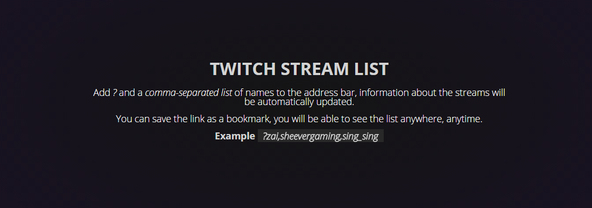
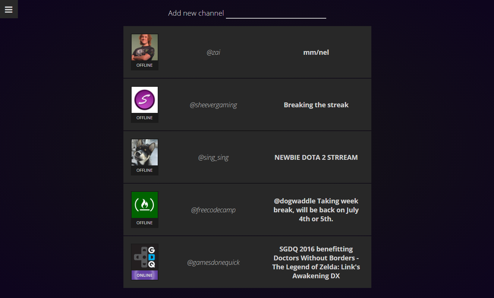
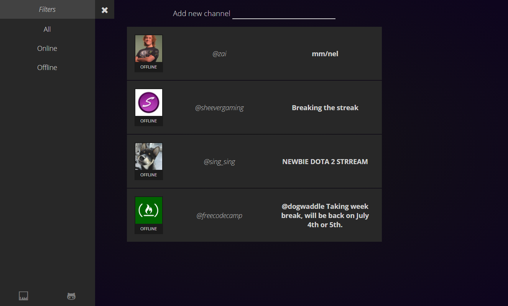

#jsTwitchList
Twitch app for FreeCodeCamp zipline: https://www.freecodecamp.com/challenges/use-the-twitchtv-json-api

#Preview as of 05-Jul-16

##[Demo](http://iamsquare.it/twitch/)

Extensions used:
* [angularjs@1.5.8](https://angularjs.org/)

###TODO:
* Embed player directly into the page.
* Add channel name validation on insert.